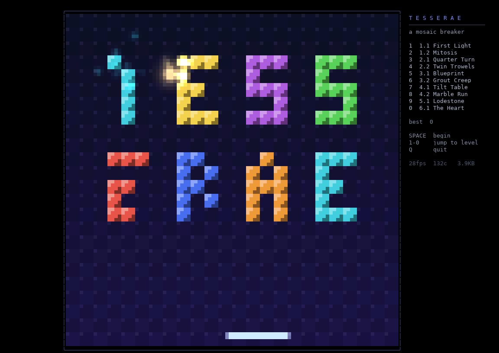

# TESSERAE

A lunch-break mosaic breaker for the terminal, written in [let-go](https://github.com/nooga/let-go).

> Above the world hangs the Mosaic: ten thousand living tesserae, each a shard of the
> sky's memory. Then the Grout came. You are the last Lapidary. You carry a Trowel and a
> Spark. Break what is dead. Set what is lost. Turn the sky.



## Play

```sh
./play.sh                       # title screen; SPACE to begin, 1-0 to jump to a level
./play.sh --level 3             # start at level 3 (with its story card)
./play.sh --level 3 --skip-card --autoplay --stats   # watch the autopilot, show fps/bytes
./play.sh --glyphs sextant      # ball silhouettes: quadrant (default) | sextant | off
LG=/path/to/lg ./play.sh        # use another let-go binary
```

You need a truecolor terminal at least 76x24. 124x50 or larger doubles the raster. Kitty,
Ghostty, WezTerm, foot and recent iTerm2 send real key-release events, so held keys feel
exact there. Elsewhere a short-hold model rides the key repeat. Mouse movement steers the
trowel in any terminal that reports motion.

| keys | |
|---|---|
| ← → / A D / mouse | move the trowel |
| SPACE / click | launch; magnet pulse on Lodestone; level the table on Tilt |
| ← ↑ → ↓ | tilt the table (Tilt) / move your borrowed tile (Heart) |
| TAB | take another tile (Heart, costs 25) |
| P | pause, R restart level, Q back to the menu, Ctrl-C quit |

## The ten levels (v0)

| | level | what's new |
|---|---|---|
| I · The Chipping | 1.1 First Light | Bricks are packed tetrominoes; clearing a whole piece is a SET bonus |
| | 1.2 Mitosis | Cell tiles split the Spark; 2-hit hard tiles |
| II · The Turning | 2.1 Quarter Turn | The whole field rotates 90° every 15 s while play continues; your trowel stays put |
| | 2.2 Twin Trowels | Top and bottom trowels move together, two open edges, two balls, rotation |
| III · The Setting | 3.1 Blueprint | **Reverse breakout**: ghost tiles set solid (gold-rimmed) when struck; build the crown |
| | 3.2 Grout Creep | Reverse mode where set tiles periodically crumble back to ghosts |
| IV · The Tilt | 4.1 Tilt Table | No paddle: tilt a labyrinth to roll a marble to every lamp; pits swallow it |
| | 4.2 Marble Run | Three marbles, breakable soft walls |
| V · Lodestone | 5.1 Lodestone | Gravity, magnetic tiles that bend the Spark, a magnet trowel (catch / aim / release), rubber and lead balls |
| VI · The Heart | 6.1 The Heart | The Spark starts walled in; no paddle; you steer one tile the game lends you, and it moves on every 8 s |

## How it renders

Every terminal cell is two square *pixels* (`▀` with fg = top, bg = bottom), so the arena is a
true square raster that can be sampled through any rotation. Tiles and balls live in a 48×48
world; the screen samples it through the current field angle. That is why the quarter turns
are real rotations and not swaps.

Per frame (`tesserae/gfx.lg`):

1. The static layer (tiles, background, pegboard) sits in a posterized world-pixel cache. Only
   tiles that change are re-sampled.
2. Balls, trails, particles and lodestone halos add light to a screen-space accumulation
   buffer and mark their cells dirty. The trowel writes a solid overlay with horizontal
   anti-aliasing. Ball cores are sub-cell *glyph sprites*: the disc's coverage of the cell's
   2×2 quadrant or 2×3 sextant subcells is thresholded, and the mask is the glyph index
   (fg = ball light, bg = the cell's darker pixel). Sextants (U+1FB00) need a font or
   terminal that draws them (Ghostty, kitty, WezTerm, foot); `--glyphs off` is the plain
   light-buffer ball.
3. `compose!` walks dirty rows and cells only, adds light, posterizes to 6 bits per channel
   before diffing, and compares against what the terminal already shows. It emits changed
   cells with SGR state tracking, contiguous-run cursor elision and cached SGR strings, all
   inside one DEC 2026 synchronized frame.

Steady play costs about 60–150 changed cells, 2–4 KB, per frame at 50 fps. A full-field redraw
(rotation, level start) is the expensive case; see `docs/PLAN.md` for the AOT path.

Physics runs at a fixed 240 Hz substep: axis-separated tile collisions, paddle bounces
computed in the screen frame (so the field can turn under a moving ball), screen-frame
gravity and tilt, and inverse-square lodestones.

## Layout

```
main.lg              arg parsing, entry
tesserae/gfx.lg      square-pixel raster, rotation, light buffer, diffed emitter
tesserae/world.lg    24x24 tile grid (flat arrays), tetromino packer, pixel sampler
tesserae/input.lg    kitty key protocol, repeat-hold fallback, SGR mouse motion
tesserae/levels.lg   story, chapters, maps (ASCII or generator fns), themes
tesserae/game.lg     rules, physics, modes, HUD, cards, frame loop
tools/               capture (tmux -> PNG/GIF), level runner, wait-for
docs/PLAN.md         phases and what's next
docs/captures/       milestone screenshots
```
