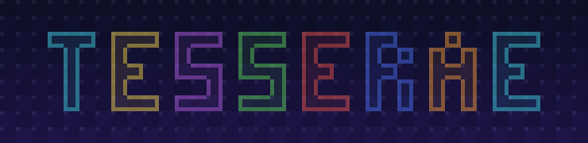
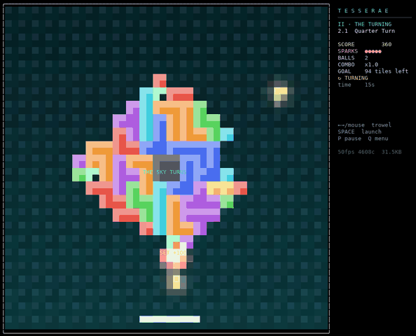
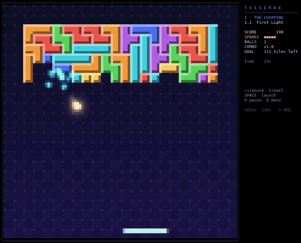
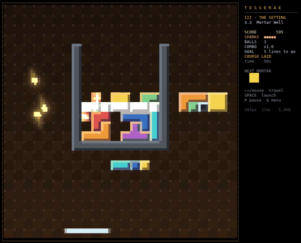
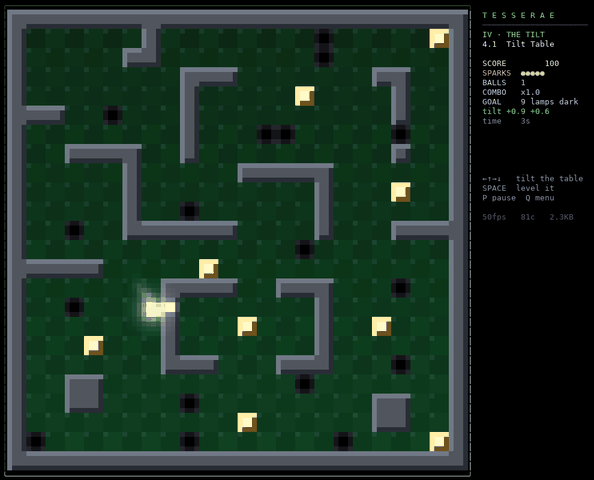
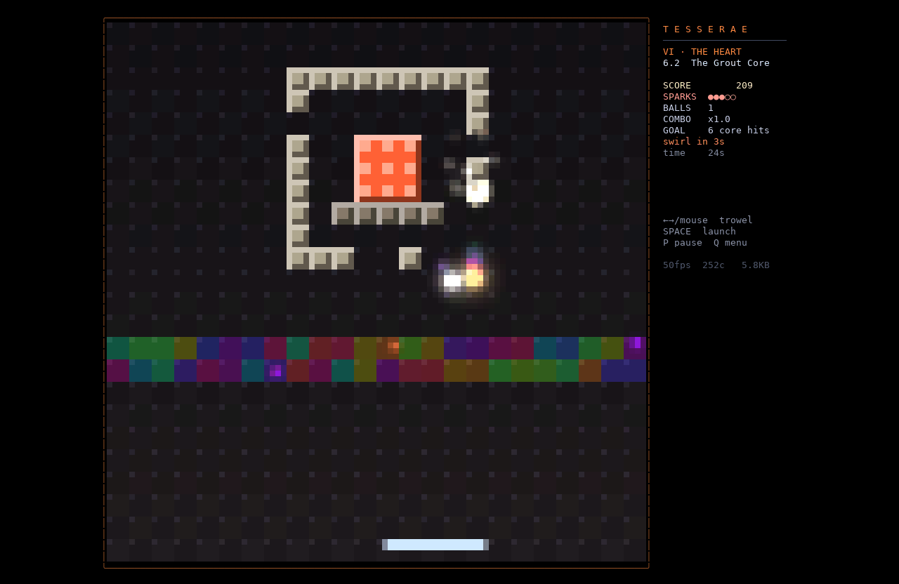
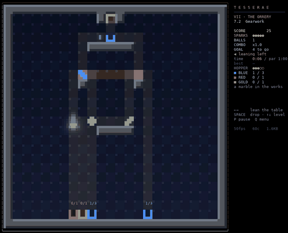
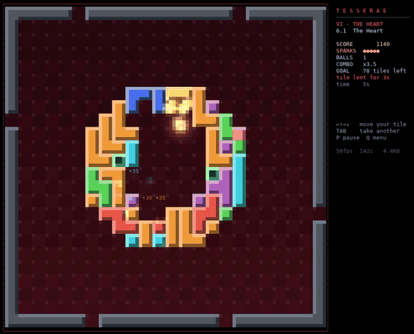

<p align="center">
  
</p>

<p align="center"><i>A lunch-break mosaic breaker for the terminal, written in <a href="https://github.com/nooga/let-go">let-go</a>.</i></p>

> Above the world hangs the Mosaic: ten thousand living tesserae, each a shard of the
> sky's memory. Then the Grout came. You are the last Lapidary. You carry a Trowel and a
> Spark. Break what is dead. Set what is lost. Turn the sky.

<p align="center">
  
  <br><sub>Every cell is two square pixels, so the field is a real raster. Here it turns a quarter while the Spark is in flight.</sub>
</p>

<table>
  <tr>
    <td width="50%"><br><sub><b>I · The Chipping</b>: walls of packed tetrominoes; clear a whole piece for a SET bonus</sub></td>
    <td width="50%"><br><sub><b>III · The Setting</b>: reverse breakout and a Tetris well you shove and turn with the Spark</sub></td>
  </tr>
  <tr>
    <td><br><sub><b>IV · The Tilt</b>: no trowel; tilt the table to roll marbles to every lamp</sub></td>
    <td><br><sub><b>VI · The Heart</b>: the Grout Core, behind a scrolling shield and a neutral zone</sub></td>
  </tr>
  <tr>
    <td><br><sub><b>VII · The Orrery</b>: marble logic in the spirit of Turing Tumble</sub></td>
    <td><br><sub><b>VI · The Heart</b>: the Spark starts walled in, and you steer one borrowed tile</sub></td>
  </tr>
</table>

## Play

```sh
./play.sh                       # title screen; SPACE to begin, 1-0 - = [ ] \ to jump to a level
./play.sh --level 3             # start at level 3 (with its story card)
./play.sh --level 3 --skip-card --autoplay --stats   # watch the autopilot, show fps/bytes
./play.sh --glyphs sextant      # ball silhouettes: quadrant (default) | sextant | off
./play.sh --3d                  # tilt levels in 3D (spike): a perspective table you can see lean
./play.sh --level 4.3           # High Table, the 3D showcase (a special level, no title key)
./play.sh --all                 # unlock every level on the title screen (testing)
./play.sh --reset-progress      # forget saved scores, medals and unlocks
LG=/path/to/lg ./play.sh        # use another let-go binary
```

You need a truecolor terminal at least 76x24. 124x50 or larger doubles the raster. Kitty,
Ghostty, WezTerm, foot and recent iTerm2 send real key-release events, so held keys feel
exact there. Elsewhere a short-hold model rides the key repeat. Mouse movement steers the
trowel in any terminal that reports motion.

| keys | |
|---|---|
| ← → / A D / mouse | move the trowel |
| SPACE / click | launch; magnet pulse on Lodestone; level the table on Tilt |
| ← ↑ → ↓ | tilt the table (Tilt) / move your borrowed tile (Heart) |
| ← → / ↑ ↓ / SPACE | Orrery: lean the table / level it / drop a marble from the hopper |
| TAB | take another tile (Heart, costs 25) |
| P | pause, R restart level, Q back to the menu, Ctrl-C quit |
| ] / [ | debug: win the level / lose a spark |

### Progress, unlocks and medals

Progress is saved with let-go's `storage` namespace: one file per key under
`~/.config/let-go/storage/<store>/` (`$XDG_CONFIG_HOME` if set). `play.sh` passes
`-storage-id tesserae`; set `TESS_STORAGE_ID` to use another store. Keys are `best`
(overall best score), `furthest` (the furthest unlocked level id) and `level/<id>`
(best level score, best clear time, best medal, flawless flag), stored as EDN. If
storage fails the game keeps running and the title panel says "progress not saved".
`--autoplay` runs never save.

On the title screen a level key starts only unlocked levels: level 1, plus every
level up to the one after your furthest clear. `--level N` always bypasses locks.
Each level has a par time. A clear at or under par earns gold (●), within 1.5× par
silver, otherwise bronze; a clear without losing a spark adds +500 and a ✦. The clear
tally shows time against par, the medal, sets laid, the bonuses and new bests.

## The twelve levels, and a bonus chapter

| | level | what's new |
|---|---|---|
| I · The Chipping | 1.1 First Light | Bricks are packed tetrominoes; clearing a whole piece is a SET bonus |
| | 1.2 Mitosis | Cell tiles split the Spark; 2-hit hard tiles; a glass pickup (the Spark shatters into three on the trowel) |
| II · The Turning | 2.1 Quarter Turn | The whole field rotates 90° every 15 s while play continues; your trowel stays put |
| | 2.2 Twin Trowels | Top and bottom trowels move together, two open edges, two balls, rotation |
| III · The Setting | 3.1 Blueprint | **Reverse breakout**: ghost tiles set solid (gold-rimmed) when struck; build the crown |
| | 3.2 Grout Creep | Reverse mode where set tiles periodically crumble back to ghosts |
| | 3.3 Mortar Well | Breakout × Tetris: mortar tetrominoes fall down a steel well; strike a piece's side to shove it, from below to turn it; full courses clear. Lay five |
| IV · The Tilt | 4.1 Tilt Table | No paddle: tilt a labyrinth to roll a marble to every lamp; pits swallow it |
| | 4.2 Marble Run | Three marbles, breakable soft walls |
| V · Lodestone | 5.1 Lodestone | Gravity, magnetic tiles that bend the Spark, a magnet trowel (catch / aim / release), rubber, lead and ghost balls (ghost slips through three tiles) |
| VI · The Heart | 6.1 The Heart | The Spark starts walled in; no paddle; you steer one tile the game lends you, and it moves on every 8 s |
| | 6.2 The Grout Core | Finale, after Yars' Revenge: a pulsing core (6 hits) behind a scrolling, self-mending shield; a rainbow neutral zone that spins the Spark; a homing Destroyer that stuns the trowel; a Swirl to dodge every 12 s |
| VII · The Orrery | 7.1 Escapement | Bonus chapter, opened by clearing 6.2. Marble logic after Turing Tumble: SPACE drops a marble from the hopper, it waits in the escapement until you lean the table, and bits send each marble the way they lean, then flip. Fill the cups exactly |
| | 7.2 Gearwork | Two bits on one axle flip together; a crossover lets a rolling marble pass over a falling one |
| | 7.3 Counting House | A three-bit ripple counter: make it read 1 0 1 with three marbles |

## How it renders

Every terminal cell is two square *pixels* (`▀` with fg = top, bg = bottom), so the arena is a
true square raster that can be sampled through any rotation. Tiles and balls live in a 48×48
world; the screen samples it through the current field angle. That is why the quarter turns
are real rotations and not swaps.

Per frame (`tesserae/gfx.lg`):

1. The static layer (tiles, background, pegboard) sits in a posterized world-pixel cache. Only
   tiles that change are re-sampled.
2. Balls, trails, particles and lodestone halos add light to a screen-space accumulation
   buffer and mark their cells dirty. The trowel writes a solid overlay with horizontal
   anti-aliasing. Ball cores are sub-cell *glyph sprites*: the disc's coverage of the cell's
   2×2 quadrant or 2×3 sextant subcells is thresholded, and the mask is the glyph index
   (fg = ball light, bg = the cell's darker pixel). Sextants (U+1FB00) need a font or
   terminal that draws them (Ghostty, kitty, WezTerm, foot); `--glyphs off` is the plain
   light-buffer ball.
3. `compose!` walks dirty rows and cells only, adds light, posterizes to 6 bits per channel
   before diffing, and compares against what the terminal already shows. It emits changed
   cells with SGR state tracking, contiguous-run cursor elision and cached SGR strings, all
   inside one DEC 2026 synchronized frame.

Steady play costs about 60–150 changed cells, 2–4 KB, per frame at 50 fps. A full-field redraw
(rotation, level start) is the expensive case; see `docs/PLAN.md` for the AOT path.

The 3D tilt table (`--3d`, `tesserae/table3d.lg`, a spike) swaps the inverse rotation for a
perspective camera over the tilted board. Per screen pixel, two inverse homographies (the
plane at the tallest column's height and the felt) give the view ray's shadow on the board; a
short grid walk finds the first column it meets (a lit side face or a cached top) or the felt
(lit by the board normal, shadowed by nearby columns, with a lamp's sheen that slides as the
table tilts). Pits are holes and the table has a slab edge. The board renders into a
screen-pixel buffer only when the quantized tilt or a tile changes: half the coarse 2×2 rows
per frame while tilting, then full resolution once it holds. Marbles are spheres with a cast
shadow; walls ring when struck hard.

Physics runs at a fixed 240 Hz substep: axis-separated tile collisions, paddle bounces
computed in the screen frame (so the field can turn under a moving ball), screen-frame
gravity and tilt, and inverse-square lodestones.

## Editor

```sh
./play.sh --edit levels/custom/mine.edn    # open (or start) a map; no file = levels/custom/untitled-N.edn
./play.sh --map levels/custom/twin-gates.edn   # play a custom map straight away, exit after the clear
```


The editor draws the map with the game's renderer and theme, so `?` and `,` regions show
packed into tetrominoes exactly as they will play (the file keeps the raw chars). A pulsing
outline marks the cursor; with mirror on, a dim one marks its mirror cell. The panel shows
the palette, the brush, the level settings and the keys.

| keys | |
|---|---|
| ← ↑ → ↓ / H J K L | move the cursor |
| SPACE / ENTER | paint (or finish a rectangle) |
| `. ? , # + * % @ x $ b ^ ~` | pick that brush (`b` = ball start `B`) |
| [ / ] | step through the whole palette |
| C / TAB | next piece colour (I O T S Z J L) / solid ↔ ghost (`?`↔`,`, `I`↔`i`) |
| E | pick the brush from the tile under the cursor |
| F | flood-fill the region under the cursor |
| R | rectangle: R marks a corner, move, R or SPACE fills |
| M | mirror painting across the vertical centre line |
| D | pen: paint while moving |
| U | undo (30 steps) |
| T / G | theme / goal (`:clear :build :lamps :heart`; lamps turns tilt on, heart turns ward on) |
| 1-6 | flags: rotate, twin, tilt, gravity, magnet, ward |
| - / = and 9 / 0 | Spark speed / par time |
| P | play-test; Q in the game comes back with the map unchanged |
| S / Q | save / quit (Q asks again when there are unsaved changes) |

Custom maps are EDN, one key per line and one map row per line:

```clojure
{:name "Twin Gates"
 :theme :teal            ; indigo teal umber felt violet crimson grout
 :goal :clear            ; clear build lamps heart
 :speed 28.8
 :par 120                ; seconds for gold
 :rotate 15.0            ; optional: :rotate s, :twin true :balls 2, :tilt true,
                         ;   :gravity 9.0, :magnet true, :ward true :boundary :open
 :map ["........................"
       ...                ; 24 rows of 24 legend chars (see tesserae/levels.lg)
       "........................"]}
```

Loading checks the size, the legend (the Grout Core's `=` and `C` are not allowed), the
theme, the goal and the types, and `--map`/`--edit` stop with a message on a bad file.
Custom runs never touch saved progress or medals: the tally shows the medal against the
map's par, nothing is stored. Play-test refuses a map with nothing to play for, or a tilt
or ward map without a `B` start. Two examples ship in `levels/custom/`, both made in the
editor.

## Browser build

TESSERAE also runs in a browser tab, built with let-go's WASM target (`lg -w`) and
shown in xterm.js.

```sh
./tools/serve-web.sh            # build dist/web, serve http://127.0.0.1:8360/
NO_BUILD=1 ./tools/serve-web.sh 8361   # serve the existing build on another port
./tools/build-web.sh [outdir]   # build only (default dist/web, about 1 min, behind tools/heavy.sh)
node tools/web-shot.mjs http://127.0.0.1:8360/ /tmp/shot 6   # headless check (needs playwright; PW_MODULE=<path> to point at an install)
```


- `dist/web/index.html` is self-contained (about 8.5 MB, the program wasm is inlined)
  apart from xterm.js, which loads from jsDelivr. The shell is `web/shell.html`, an
  `-w-shell` template that picks the font size so the grid reaches 124x50 (the doubled
  raster) when the window allows it, and uses xterm's WebGL renderer.
- The page must be served cross-origin isolated (COOP/COEP headers). Otherwise the first
  key read fails with "no SharedArrayBuffer". `tools/coi-serve.py` does this;
  `python -m http.server` does not.
- No command line in a browser, so play.sh's flags come from the URL:
  `?level=3&skip-card&autoplay&stats&glyphs=sextant&fps=30&all`. The shell adds
  `?grid=small`, which skips the doubled raster: a quarter of the pixels, roughly twice
  the frame rate.
- Progress isn't saved in the browser yet. let-go's browser storage needs
  `localStorage`, and the VM runs in a Web Worker, which has none, so the title panel
  says "progress not saved".
- Ctrl-C and Q on the title screen don't quit, because a tab has nothing to quit to.
  Resizing the window refits the grid, and the game re-lays out within half a second.

## The 3D tilt table (this branch)

This branch (`spike/table3d`) adds a 3D view of the tilt-labyrinth table: a perspective camera
over a tilting board, extruded walls, lighting that shifts with the tilt, and a marble with a
cast shadow. Physics is unchanged.

```sh
git checkout spike/table3d
./play.sh --level 4.3 --3d      # High Table, the showcase (a special level, not on the title list)
./play.sh --3d                  # every tilt level in 3D, including 4.1, 4.2 and the Orrery
TESS_STORAGE_ID=spike3d ./play.sh --3d   # keep spike runs out of your saved progress
```

← ↑ → ↓ tilt the table (it stays where you leave it), SPACE levels it. Motion frames render
coarse and sharpen once the tilt holds. A terminal of 124×50 or more doubles the raster; the
marble reads much better at 3–4× (around 220×80).

To build an AOT binary for the spike, follow "AOT build (optional)" below and add the 3D
namespace to the list:

```sh
TESSERAE_AOT_LETGO=../let-go-tesserae-aot TESSERAE_AOT_OUT=../lg-tesserae-aot-3d \
  ./tools/build-aot.sh tesserae.gfx tesserae.world tesserae.table3d
LG=../lg-tesserae-aot-3d ./play.sh --level 4.3 --3d --stats
```

On the full AOT binary a tilting frame takes about 19 ms (median, High Table, k=2; 35 ms on the
VM), so tilting holds around 50 fps.

## AOT build (optional)

let-go can lower namespaces to native Go and bake them into a custom `lg`
(its `benchmark/aot` pipeline). `tools/build-aot.sh` does that for the renderer
(`tesserae.gfx`, `tesserae.world`), and the game then runs those functions natively:

```sh
# 1. a let-go checkout with the two patches the lowering needs
git clone https://github.com/mparrett/let-go.git ../let-go-tesserae-aot
git -C ../let-go-tesserae-aot checkout wt/tesserae-aot

# 2. build the binary (Go toolchain required; about a minute)
TESSERAE_AOT_LETGO=../let-go-tesserae-aot TESSERAE_AOT_OUT=../lg-tesserae-aot \
  ./tools/build-aot.sh

# 3. play on it
LG=../lg-tesserae-aot ./play.sh --stats
```

- `wt/tesserae-aot` is upstream let-go (including the #1051 lowering fix) plus two commits:
  guarded native overrides for functions with typed params (without it most hot functions
  silently stay on bytecode) and cached var reads in lowered code.
- The whole build takes about 70 s. On a let-go older than
  [let-go#1051](https://github.com/nooga/let-go/pull/1051), lowering `compose!` takes over an
  hour; set `AOT_SKIP=compose!` there to leave it on the VM.
- The binary replaces the game's functions by name, so rebuild it after editing `gfx.lg` or
  `world.lg`, or your edits won't run.
- What to expect (k=2): full-field redraws about 2.3× faster (rotated frame 53–56 → 23–24 ms),
  coarse rotation frames 2.6× (33–38 → 13–14 ms), idle compose about 3×.

## Tests

```sh
./tools/test.sh                 # clojure.test suites in test/; exits 1 on any failure
```

They cover `tesserae.input/parse` (plain keys, CSI/SS3 arrows, kitty CSI-u
press/repeat/release, BEL resize, Ctrl-C, mouse maps), tetromino packing determinism,
level map validity (24×24, goal count > 0, a par per level), the meta layer (medals,
unlocks, a storage round trip in the throwaway store `tesserae-test`) and custom map files
(EDN round trip, validation, the shipped examples).

## Layout

About 4,000 lines of let-go (code lines, excluding blanks and comments; docstrings count as code) with no dependencies beyond let-go's own `term` namespace, plus about 250 lines of tests.

```
                     lines  what
main.lg                 51  arg parsing, entry
tesserae/game.lg      2371  rules, physics, modes, HUD, cards, clear tally, frame loop
tesserae/gfx.lg        544  square-pixel raster, rotation, light buffer, diffed emitter
tesserae/levels.lg     503  story, chapters, maps (ASCII or generator fns), themes
tesserae/editor.lg     455  the level editor (--edit), play-test through game.lg's custom hooks
tesserae/world.lg      335  24x24 tile grid (flat arrays), tetromino packer, pixel sampler
tesserae/meta.lg       148  saved progress (let-go storage), unlocks, par medals
tesserae/custom.lg     142  custom map EDN format: validate, read, write, -> level
tesserae/input.lg      128  kitty key protocol, repeat-hold fallback, SGR mouse motion
levels/custom/              custom maps (EDN)
test/                  276  clojure.test suites, run by tools/test.sh
tools/                      capture (tmux -> PNG/GIF), level runner, sim, banner, AOT/web builds
docs/PLAN.md                phases and what's next
docs/DEVLOG.md              decisions, surprises, deferrals, perf history
docs/captures/              milestone screenshots
```
